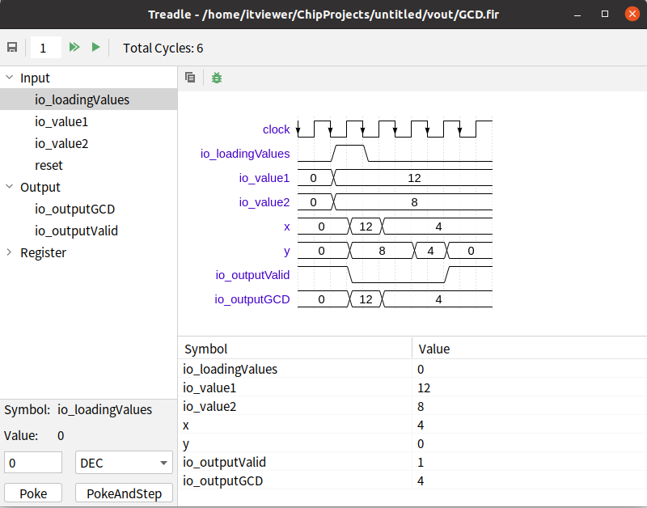

## EasySoC Treadle

An experimental interactive Firrtl simulator based on [treadle](https://github.com/chipsalliance/treadle) and [wavedrom](https://github.com/wavedrom/wavedrom). It is used for rapid circuit prototyping iterative design and unit testing.

## Features

- Interactively debug the circuit in Shell or Repl mode
- Visually peek,poke symbols and advance the clock of the DUT
- Observe the value of the selected symbol in the form of table and waveform
- Copy WaveJSON Data to Clipboard (for exporting to SVG or PNG files, see [WaveDromEditor](http://wavedrom.com/editor.html))

## Notes

- The size of RollBackBuffers is 32 and cannot be modified at present
- The  Shell or Repl mode support command auto completion and historical commands
- Waveform always displays data in decimal format
- When poke symbols, hexadecimal and binary input data do not contain prefix (`b` or `0x`)
- When using Repl mode, make sure the java path is in the system environment variable. 

## Install

https://plugins.jetbrains.com/plugin/16914-easysoc-treadle

Usage: When opening a Firrtl file, the menu `HDL->Treadle Simulator` and `Treadle Shell` becomes available.

## FAQs

1. How to add a monitoring signal

    Double-click on the symbol tree to add or remove symbols to the watch list.
    
2. How to use repl mode to debug interactively

    See [What is the Treadle Repl](https://github.com/chipsalliance/treadle/wiki/What-is-the-Treadle-Repl) or enter `help` to view the help content

